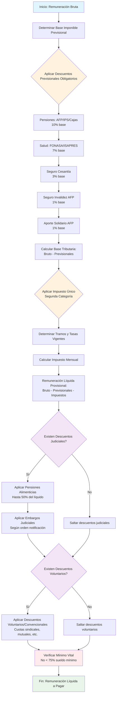
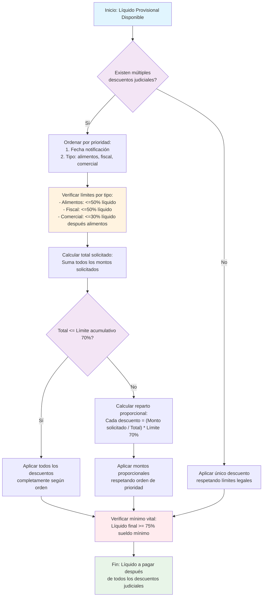
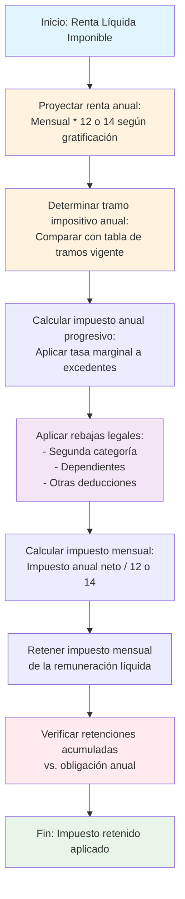

# 3. Procedimiento Integral de Cálculo de Remuneraciones Públicas

## 3.1. Fundamentos del Cálculo Remunerativo en el Sector Público

El cálculo de remuneraciones en el sector público chileno constituye un proceso técnico-administrativo de alta complejidad que integra múltiples componentes normativos, previsionales, tributarios y contractuales en un flujo estructurado que debe garantizar precisión matemática, cumplimiento legal absoluto y equidad en la distribución de recursos públicos. Este capítulo detalla el procedimiento completo desde la determinación de los haberes brutos hasta el cálculo del líquido a pagar, considerando todas las interacciones, prioridades y particularidades que caracterizan los sistemas remunerativos estatales.

### Marco conceptual del cálculo remunerativo público

#### Principios rectores del cálculo
- **Legalidad estricta**: Cada componente debe tener fundamento en normativa vigente y aplicable
- **Temporalidad precisa**: Los cálculos deben reflejar valores y parámetros vigentes en el período correspondiente
- **Proporcionalidad exacta**: Componentes variables deben calcularse con fórmulas matemáticas precisas
- **Transparencia completa**: Capacidad de reconstruir y justificar cada paso del cálculo
- **Priorización normativa**: Respeto de jerarquías entre diferentes tipos de descuentos y beneficios

#### Dimensiones del cálculo remunerativo
1. **Dimensión normativa**: Aplicación de leyes, decretos, resoluciones y convenios colectivos
2. **Dimensión temporal**: Consideración de períodos, antigüedades, fechas de efecto y vigencia
3. **Dimensión previsional**: Integración de sistemas de pensiones, salud y seguros laborales
4. **Dimensión tributaria**: Aplicación de impuestos, retenciones y obligaciones fiscales
5. **Dimensión contractual**: Respeto a condiciones específicas de contratos individuales y colectivos

## 3.2. Componentes Estructurales de las Remuneraciones Públicas

### Haberes o Ingresos Brutos

#### Sueldo Base o Asignación de Grado
- **Definición**: Remuneración fija establecida según grado, escalafón o nivel jerárquico
- **Determinación**: Según tabla salarial vigente, tipo de contrato y categoría institucional
- **Variaciones**: Reajustes anuales, ascensos, cambios de grado o escalafón
- **Ejemplos**: Sueldo base de funcionario de planta, asignación de grado militar, salario base administrativo

#### Asignaciones Permanentes
- **Asignación de Antigüedad (Bienios)**: Incremento porcentual o fijo por años de servicio
- **Asignación de Titulación**: Reconocimiento por títulos profesionales o técnicos
- **Asignación de Zona**: Adicional por trabajo en regiones extremas o zonas especiales
- **Asignación de Riesgo**: Compensación por trabajo en condiciones peligrosas
- **Asignación de Desempeño Individual**: Componente variable vinculado a evaluación de desempeño
- **Asignación de Responsabilidad**: Adicional por cargos de jefatura o supervisión

#### Bonificaciones y Beneficios Variables
- **Gratificación Legal**: 25% de la remuneración imponible con tope de 4,75 UTM
- **Colación y Movilización**: Asignaciones no imponibles con montos establecidos
- **Bonos de Productividad**: Vinculados a cumplimiento de metas institucionales
- **Compensaciones por Turnos**: Recargos por trabajo en horarios nocturnos, festivos o extraordinarios
- **Asignaciones por Estudios**: Reconocimiento por cursos de capacitación o perfeccionamiento

#### Componentes Especiales por Sector
- **Salud**: Asignaciones por guardias, turnos extraordinarios, especialización médica
- **Educación**: Bonificación por desempeño colectivo, asignación de excelencia pedagógica
- **Seguridad**: Compensaciones por riesgo penitenciario, servicio de frontera, operaciones especiales
- **Administración Pública**: Asignaciones por función crítica, disponibilidad permanente

### Base Imponible Previsional y Tributaria

#### Cálculo de la Remuneración Imponible
- **Componentes imponibles**: Sueldo base + asignaciones permanentes + gratificación legal + bonos imponibles
- **Componentes no imponibles**: Colación, movilización, asignación familiar (hasta cierto monto)
- **Tope imponible**: Límites establecidos por ley (90 UTM para AFP, sin tope para IPS)
- **Proceso de cálculo**:
  1. Sumar todos los haberes imponibles del período
  2. Aplicar proporcionalidad por días trabajados si corresponde
  3. Verificar respeto de topes legales
  4. Determinar base para cada sistema previsional aplicable

#### Diferenciación por Sistemas Previsionales
- **Régimen AFP**: Base imponible con tope de 90 UTM, aplicable a funcionarios bajo DL 3.500
- **Régimen IPS**: Base imponible sin tope, aplicable a funcionarios de planta y contrata
- **Régimen de Cajas Especiales**: Base específica para FF.AA., policías, instituciones con sistemas propios
- **Personal a Honorarios**: Tratamiento especial según ley 19.863 (rentas asimiladas a salario)

## 3.3. Sistemas Previsionales y de Salud en el Cálculo Remunerativo

### Arquitectura de los Sistemas de Protección Social

#### Sistema de Pensiones (Previsión)
- **Administradoras de Fondos de Pensiones (AFP)**: Régimen de capitalización individual
  - Cotización obligatoria: 10% para pensión + comisión de administración variable
  - Cotización adicional: 1% para seguro de invalidez y sobrevivencia (SIS)
  - Aporte solidario: 1% para pensiones solidarias (Ley 20.255)
  - **Cálculo**: Base imponible × porcentajes vigentes en el período

- **Instituto de Previsión Social (IPS) - Régimen de Reparto**:
  - Cotización para pensión: 10% (similar porcentaje pero sistema diferente)
  - Seguro de invalidez y sobrevivencia: Incluido en cotización general
  - **Particularidad**: Sin tope imponible, cálculo sobre total de remuneración imponible

- **Cajas de Previsión Especiales**:
  - Caja de Previsión de la Defensa Nacional (CAPREDENA)
  - Dirección de Previsión de Carabineros (DIPRECA)
  - Caja de Previsión de los Funcionarios y Empleados del Poder Judicial
  - **Características**: Porcentajes específicos, beneficios adicionales, regímenes propios

#### Sistema de Salud
- **Fondo Nacional de Salud (FONASA)**:
  - Cotización: 7% de la remuneración imponible
  - Tope aplicable: Sin tope para FONASA
  - Cobertura: Sistema público de salud
  - **Cálculo**: Base imponible × 7% (con límites específicos por ley)

- **Instituciones de Salud Previsional (ISAPRES)**:
  - Cotización: 7% de la remuneración imponible (mínimo legal)
  - Planes adicionales: Cotizaciones voluntarias para mejores coberturas
  - **Cálculo**: Base imponible × porcentaje contractual (mínimo 7%)

- **Sistemas de Salud Propios**:
  - Salud militar, policial o institucional
  - Porcentajes específicos según normativa institucional
  - Cobertura integral para funcionario y grupo familiar

#### Seguro de Cesantía
- **Cotización**: 3% de la remuneración imponible (2,4% empleador, 0,6% trabajador)
- **Fondo de Cesantía**: Administrado por AFP o IPS según afiliación
- **Cálculo**: Base imponible × porcentajes vigentes

### Proceso de Cálculo de Cotizaciones

#### Secuencia de Aplicación
1. **Determinar base imponible previsional** según régimen correspondiente
2. **Aplicar cotización de pensiones** (AFP 10%, IPS 10%, Cajas especiales según porcentaje)
3. **Aplicar cotización de salud** (FONASA 7%, ISAPRES 7% o porcentaje contractual)
4. **Aplicar seguro de cesantía** (3% total)
5. **Aplicar seguro de invalidez y sobrevivencia** (1% en AFP)
6. **Aplicar aporte solidario** (1% en AFP)

#### Fórmulas de Cálculo Detalladas
```
// Para régimen AFP
cotizacion_pension = MIN(base_imponible, tope_afp) * 0.10
seguro_invalidez = MIN(base_imponible, tope_afp) * 0.01
aporte_solidario = MIN(base_imponible, tope_afp) * 0.01
cotizacion_salud = base_imponible * porcentaje_salud
seguro_cesantia = base_imponible * 0.03

// Para régimen IPS
cotizacion_pension = base_imponible * 0.10
cotizacion_salud = base_imponible * porcentaje_salud
seguro_cesantia = base_imponible * 0.03
```

#### Consideraciones Especiales
- **Personal con múltiples empleadores**: Acumulación de cotizaciones con topes individuales
- **Períodos parciales**: Cálculo proporcional por días trabajados
- **Licencias médicas**: Tratamiento especial de cotizaciones durante incapacidades
- **Bonos y beneficios variables**: Impacto diferenciado en base imponible según tipo

## 3.4. Descuentos Legales y su Jerarquía de Aplicación

### Taxonomía de los Descuentos Remunerativos

#### Descuentos Obligatorios de Orden Judicial
- **Pensiones de Alimentos**: Hasta 50% de la remuneración líquida (art. 6 ley 14.908)
- **Embargos Judiciales**: Porcentajes establecidos por tribunales con prioridad específica
- **Multas Judiciales**: Descuentos por sentencias firmes
- ****Prioridad absoluta**: Se aplican antes que cualquier otro descuento (excepto impuestos en algunos casos)
- **Base de cálculo**: Remuneración líquida después de ciertos descuentos previsionales

#### Descuentos Tributarios Obligatorios
- **Impuesto Único de Segunda Categoría**:
  - Aplicación sobre rentas del trabajo dependiente
  - Tramos progresivos reajustados anualmente
  - Rebajas y créditos específicos
  - **Base de cálculo**: Remuneración imponible menos cotizaciones previsionales obligatorias

- **Otros Impuestos y Contribuciones**:
  - Impuestos municipales
  - Contribuciones especiales sectoriales
  - **Prioridad**: Alta, generalmente después de descuentos judiciales

#### Descuentos Previsionales Obligatorios
- **Cotizaciones de Pensiones**: AFP, IPS, Cajas especiales
- **Cotizaciones de Salud**: FONASA, ISAPRES
- **Seguros Sociales**: Cesantía, invalidez, sobrevivencia
- ****Prioridad**: Media-alta, generalmente antes de impuestos pero después de judiciales en líquido

#### Descuentos Voluntarios y Convencionales
- **Aportes a Mutuales**: Cajas de compensación (ej: Los Héroes, La Araucana)
- **Cuotas Sindicales**: Aporte a organización sindical
- **Aportes a Instituciones**: Clubes deportivos, obras sociales institucionales
- **Préstamos y Adelantos**: Descuentos por préstamos otorgados por la institución
- ****Prioridad**: Baja, se aplican después de todos los descuentos obligatorios

### Jerarquía y Secuencia de Aplicación de Descuentos

#### Principios de Priorización
1. **Principio de Interés Público**: Descuentos que protegen derechos fundamentales tienen prioridad (alimentos)
2. **Principio de Obligatoriedad Legal**: Descuentos establecidos por ley prevalecen sobre convencionales
3. **Principio de Temporalidad**: Descuentos con fechas límite tienen prioridad sobre permanentes
4. **Principio de Proporcionalidad**: Ningún descuento puede dejar al trabajador bajo mínimo vital

#### Secuencia Operativa Estándar
```
1. Calcular remuneración bruta (todos los haberes del período)
2. Determinar base imponible previsional
3. Aplicar descuentos previsionales obligatorios:
   a. Cotización pensiones (AFP/IPS/Cajas)
   b. Cotización salud (FONASA/ISAPRES)
   c. Seguro cesantía
   d. Seguro invalidez (AFP)
   e. Aporte solidario (AFP)

4. Determinar base imponible tributaria:
   Base = Remuneración bruta - Cotizaciones previsionales obligatorias

5. Aplicar Impuesto Único de Segunda Categoría sobre base tributaria

6. Calcular remuneración líquida provisional:
   Líquido provisional = Bruto - Previsionales - Impuesto único

7. Aplicar descuentos judiciales sobre remuneración líquida provisional:
   a. Pensiones alimenticias
   b. Embargos judiciales

8. Aplicar descuentos voluntarios y convencionales sobre líquido resultante

9. Verificar mínimo vital (no puede quedar bajo 75% del sueldo mínimo)
```

#### Diagrama de Flujo del Proceso de Cálculo



#### Reglas Especiales de Prioridad
- **Pensiones alimenticias**: Máxima prioridad, hasta 50% del líquido, pueden desplazar otros descuentos
- **Embargos judiciales**: Prioridad según orden de notificación, límites según tipo de embargo
- **Impuestos vs. Judiciales**: En Chile, pensiones alimenticias tienen prioridad sobre impuestos
- **Múltiples descuentos judiciales**: Orden de notificación determina prioridad
- **Límites acumulativos**: Total de descuentos no puede superar porcentajes legales (generalmente 70%)

#### Casos Complejos y Matices en la Aplicación de Descuentos

##### Interacción entre Diferentes Tipos de Descuentos "Varios"

Los descuentos "varios" o adicionales presentan interacciones complejas que requieren atención especial:

1. **Descuentos por Adelantos de Sueldo vs. Judiciales**:
   - Los adelantos de sueldo otorgados por la institución tienen prioridad baja, pero pueden negociarse en convenios colectivos.
   - Cuando existen descuentos judiciales, los adelantos deben posponerse a menos que afecten el mínimo vital.
   - **Regla práctica**: Adelantos se aplican después de descuentos judiciales pero antes de voluntarios.

2. **Cuotas Sindicales vs. Aportes a Mutuales**:
   - Ambas son voluntarias/convencionales, pero las cuotas sindicales tienen mayor protección legal.
   - En caso de conflicto, las cuotas sindicales pactadas en convenio colectivo tienen prioridad sobre aportes a mutuales individuales.
   - **Base de cálculo**: Ambas se aplican sobre el líquido después de descuentos obligatorios.

3. **Descuentos por Pérdidas o Daños**:
   - Descuentos por responsabilidad en pérdidas de equipos o daños a propiedad institucional.
   - Requieren procedimiento administrativo previo y autorización expresa.
   - **Prioridad**: Similar a descuentos voluntarios, pero con base legal administrativa.

4. **Aportes a Programas de Beneficios**:
   - Aportes a programas de recreación, deporte, cultura institucional.
   - Totalmente voluntarios, requieren autorización escrita del funcionario.
   - Pueden suspenderse en cualquier momento a solicitud del funcionario.

##### Manejo de Múltiples Descuentos Judiciales Concurrentes

Cuando un funcionario tiene varias órdenes judiciales de descuento:

1. **Orden de Notificación**: Determina prioridad absoluta. La primera notificada se aplica primero.
2. **Límites por Tipo de Embargo**:
   - **Embargo por alimentos**: Hasta 50% del líquido.
   - **Embargo por deudas comerciales**: Hasta 30% del líquido después de alimentos.
   - **Embargo por obligaciones fiscales**: Hasta 50% del líquido, compite con alimentos.
3. **Proceso de Reparto Proporcional**:
   ```
   Si líquido provisional = $1.000.000
   Descuento 1 (alimentos): 50% = $500.000 (máximo legal)
   Descuento 2 (comercial): 30% = $300.000
   Descuento 3 (fiscal): 20% = $200.000
   
   Total solicitado = $1.000.000 (100%)
   Límite acumulativo = 70% = $700.000
   
   Reparto proporcional:
   - Alimentos: ($500.000 / $1.000.000) × $700.000 = $350.000 (50% del límite)
   - Comercial: ($300.000 / $1.000.000) × $700.000 = $210.000 (30%)
   - Fiscal: ($200.000 / $1.000.000) × $700.000 = $140.000 (20%)
    ```

#### Diagrama de Proceso para Múltiples Descuentos Judiciales Concurrentes



##### Descuentos Especiales por Sector Institucional

1. **Fuerzas Armadas y de Orden**:
   - Descuentos por vestuario, equipo, alojamiento en cuarteles.
   - Tratamiento especial como beneficios en especie más que descuentos monetarios.
   - Impacto en base imponible para efectos tributarios.

2. **Sector Salud**:
   - Descuentos por vivienda en residencias médicas.
   - Aportes a fondos de bienestar del personal de salud.
   - Descuentos por uso de instalaciones deportivas hospitalarias.

3. **Sector Educación**:
   - Aportes a fondos de mejoramiento educativo.
   - Descuentos por uso de bibliotecas, laboratorios.
   - Contribuciones a asociaciones de profesores.

##### Validación y Control de Descuentos

1. **Verificación de Legalidad**:
   - Cada descuento debe tener sustento legal o contractual verificado.
   - Sistema debe rechazar descuentos sin documentación soporte.

2. **Comunicación al Funcionario**:
   - Notificación previa de nuevos descuentos.
   - Derecho a reclamo y revisión.
   - Desglose mensual detallado de todos los descuentos.

3. **Ajustes por Errores**:
   - Procedimiento para corrección de descuentos aplicados incorrectamente.
   - Devolución de montos descontados erróneamente con intereses legales.
   - Ajuste en meses siguientes para regularizar diferencias.

### Cálculo del Impuesto Único de Segunda Categoría

#### Tramos y Tasas Vigentes (ejemplo ilustrativo)
```
Tramo 1: Hasta 13,5 UTA → 0%
Tramo 2: 13,5 a 30 UTA → 4%
Tramo 3: 30 a 50 UTA → 8%
Tramo 4: 50 a 70 UTA → 13,5%
Tramo 5: 70 a 90 UTA → 23%
Tramo 6: 90 a 120 UTA → 30,4%
Tramo 7: 120 a 310 UTA → 35%
Tramo 8: Más de 310 UTA → 40%
```

#### Proceso de Cálculo Paso a Paso
1. **Determinar renta líquida imponible**: Remuneración bruta - cotizaciones previsionales obligatorias
2. **Calcular impuesto anual proyectado**: Aplicar tramos a renta anualizada
3. **Determinar rebajas aplicables**: Segunda categoría, dependientes, etc.
4. **Calcular impuesto mensual**: Dividir impuesto anual por 12 o 14 según gratificación
5. **Aplicar retenciones mensuales**: Descontar impuesto calculado

#### Diagrama de Flujo del Cálculo del Impuesto Único



#### Consideraciones Especiales
- **Gratificación legal**: Considerada renta para efecto de impuesto
- **Trabajadores con múltiples empleadores**: Acumulación de rentas para determinar tramo
- **Períodos incompletos**: Proporcionalidad por días trabajados
- **Asignación familiar**: No constituye renta para efectos tributarios hasta cierto monto

## 3.5. Flujos de Cálculo por Tipo de Institución

### Administración Central (Ministerios y Servicios Públicos)

#### Características Específicas
- **Régimen previsional predominante**: IPS para planta, AFP para contrata y honorarios
- **Estructura de haberes**: Sueldo base + asignación de grado + bonos por desempeño
- **Descuentos típicos**: Mutuales, sindicatos, aportes solidarios
- **Proceso estándar**:
  1. Determinar sueldo base según escala ministerial
  2. Aplicar asignaciones por grado y antigüedad
  3. Calcular gratificación legal proporcional
  4. Aplicar cotizaciones IPS/AFP según tipo de contrato
  5. Calcular impuesto único según tramos
  6. Aplicar descuentos voluntarios institucionales

### Sistema de Salud Pública

#### Particularidades del Sector Salud
- **Multiplicidad de turnos**: Cálculo complejo de horas extraordinarias, guardias y recargos
- **Especializaciones médicas**: Asignaciones diferenciadas por especialidad y nivel
- **Régimen previsional**: Combinación de IPS para funcionarios, AFP para contratistas
- **Proceso específico**:
  1. Calcular sueldo base según especialidad y grado
  2. Agregar asignaciones por turnos y guardias (recargos 25-50%)
  3. Aplicar bonos por productividad y cumplimiento de metas
  4. Calcular cotizaciones considerando ingresos variables mensuales
  5. Aplicar descuentos por vivienda y alimentación en residencias

### Sistema Educacional Público

#### Especificidades del Personal Docente
- **Escala única docente**: Estructura salarial específica para profesores
- **Bonificaciones por evaluación**: Componentes variables según desempeño pedagógico
- **Asignación de experiencia**: Incrementos por años de servicio
- **Proceso educativo**:
  1. Determinar sueldo base según escala única y tramo de experiencia
  2. Aplicar asignación de perfeccionamiento y título
  3. Calcular bonificación por desempeño colectivo del establecimiento
  4. Aplicar asignación de ruralidad si corresponde
  5. Calcular cotizaciones sobre base que incluye componentes variables

### Instituciones de Seguridad y Orden Público

#### Complejidades de Sistemas Uniformados
- **Sistemas previsionales especiales**: CAPREDENA, DIPRECA, cajas propias
- **Asignaciones por riesgo**: Compensaciones por trabajo en condiciones peligrosas
- **Beneficios no remuneracionales**: Vivienda, salud, educación familiar
- **Proceso castrense/policial**:
  1. Determinar asignación de grado según escalafón
  2. Aplicar asignaciones por especialidad y destino geográfico
  3. Calcular compensaciones por operaciones especiales y riesgo
  4. Aplicar cotizaciones a cajas de previsión especiales
  5. Considerar beneficios en especie en cálculo de impuestos

### Municipalidades y Gobiernos Regionales

#### Diversidad en Administración Local
- **Multiplicidad de regímenes**: Combinación de personal municipal, salud, educación, aseo
- **Variabilidad territorial**: Diferentes escalas según capacidad fiscal de la comuna
- **Proceso municipal**:
  1. Determinar sueldo base según escala municipal específica
  2. Aplicar asignaciones locales establecidas por ordenanza
  3. Calcular bonificaciones por desempeño municipal
  4. Aplicar cotizaciones según tipo de personal (municipal, salud, educación)
  5. Considerar fondos de diferentes fuentes en cálculo de haberes

## 3.6. Validación, Control y Auditoría de Cálculos

### Mecanismos de Validación Interna

#### Verificación de Consistencia Matemática
- **Cálculo paralelo**: Sistema debe poder recalcular desde cero para verificar resultados
- **Verificación de límites**: Todos los montos deben estar dentro de rangos normativos
- **Consistencia temporal**: Cálculos deben ser coherentes con períodos anteriores
- **Validación de fórmulas**: Cada componente debe calcularse con fórmula normativa exacta

#### Control de Cumplimiento Normativo
- **Verificación de vigencia**: Todos los parámetros deben ser los vigentes en el período
- **Validación de aplicabilidad**: Cada norma debe aplicarse solo a personal que cumple condiciones
- **Control de topes y límites**: Respeto de máximos y mínimos establecidos por ley
- **Auditoría de prioridades**: Verificación de secuencia correcta de aplicación de descuentos

### Sistema de Trazabilidad y Documentación

#### Registro de Cada Paso del Cálculo
- **Base de cálculo**: Montos y parámetros utilizados en cada componente
- **Justificación normativa**: Disposición legal que fundamenta cada cálculo
- **Historial de cambios**: Registro de modificaciones y correcciones
- **Responsables**: Identificación de quien realizó y validó cada cálculo

#### Documentación para Auditoría Externa
- **Desglose completo**: Detalle de todos los componentes de haber y descuento
- **Conciliación contable**: Coherencia entre cálculo remunerativo y registros contables
- **Soportes documentales**: Resoluciones, contratos, certificaciones que sustentan cálculos
- **Reportes para control**: Formatos estandarizados para Contraloría, SII, Superintendencias

### Errores Comunes y su Prevención

#### Errores en Determinación de Base Imponible
- **Inclusión incorrecta de componentes no imponibles**
- **Omisión de componentes imponibles variables**
- **Aplicación errónea de topes previsionales**
- **Falta de proporcionalidad en períodos parciales**

#### Errores en Aplicación de Descuentos
- **Secuencia incorrecta de prioridades**
- **Aplicación de porcentajes erróneos o desactualizados**
- **No considerar límites acumulativos de descuentos**
- **Error en base de cálculo para descuentos judiciales**

#### Errores en Cálculo de Impuestos
- **Aplicación de tramos incorrectos por anualización errónea**
- **Omisión de rebajas o créditos aplicables**
- **Error en cálculo de gratificación para efecto tributario**
- **No considerar múltiples fuentes de renta**

### Herramientas Tecnológicas para Cálculo Preciso

#### Sistemas de Gestión de Parámetros
- **Base de datos de normativas**: Estructura que almacena y versiona toda la normativa aplicable
- **Motor de reglas de negocio**: Sistema que aplica automáticamente condiciones y fórmulas
- **Gestor de tablas salariales**: Mantenimiento de todas las escalas y sus historiales
- **Calculadora de impuestos**: Integración con parámetros del SII actualizados automáticamente

#### Plataformas de Validación Automática
- **Verificador de consistencia**: Sistema que detecta inconsistencias en cálculos
- **Simulador de escenarios**: Herramienta para probar diferentes interpretaciones normativas
- **Auditoría automatizada**: Revisión sistemática de lotes de cálculos contra reglas predefinidas
- **Generador de desgloses**: Producción automática de documentación detallada

## 3.7. Ejemplo Práctico Integral de Cálculo con Descuentos Concurrentes

### 3.7.1. Caso de Estudio: Funcionario de Planta con Múltiples Descuentos

**Escenario**: Funcionario de planta de un ministerio, régimen IPS, afiliado a FONASA, con 15 años de servicio (7 bienios), con los siguientes componentes remunerativos y descuentos aplicables:

#### Datos del Funcionario (Mes de Marzo 2026)
- **Sueldo Base (Grado 15)**: $1.200.000
- **Asignación de Antigüedad (7 bienios)**: 7 × 2% = 14% sobre sueldo base = $168.000
- **Asignación de Titulación Profesional**: $150.000
- **Asignación de Zona Extreme (30%)**: $360.000 (sobre sueldo base)
- **Gratificación Legal (25%)**: $300.000 (sobre sueldo base + asignación antigüedad)
- **Colación**: $60.000 (no imponible)
- **Movilización**: $50.000 (no imponible)

#### Descuentos Aplicables:
1. **Cotización IPS (Pensión)**: 10% sobre base imponible
2. **Cotización FONASA (Salud)**: 7% sobre base imponible  
3. **Seguro de Cesantía**: 3% sobre base imponible (2,4% empleador + 0,6% trabajador)
4. **Impuesto Único de Segunda Categoría**: Según tramos vigentes
5. **Pensión de Alimentos**: Orden judicial por 40% de remuneración líquida (2 hijos)
6. **Embargo Judicial**: Por deuda comercial equivalente a 15% del líquido
7. **Cuota Sindical**: $15.000 pactada en convenio colectivo
8. **Aporte a Mutual**: $20.000 voluntario

### 3.7.2. Cálculo Paso a Paso con Prioridad de Descuentos

#### Paso 1: Determinación de la Remuneración Bruta
```
Sueldo base: $1.200.000
Asignación antigüedad: $168.000
Asignación titulación: $150.000  
Asignación zona: $360.000
Gratificación legal: $300.000
Colación (no imponible): $60.000
Movilización (no imponible): $50.000

Total bruto = $1.200.000 + $168.000 + $150.000 + $360.000 + $300.000 = $2.178.000
Componentes no imponibles = $110.000
```

#### Paso 2: Determinación de la Base Imponible Previsional
```
Base imponible = Total bruto - Componentes no imponibles
Base imponible = $2.178.000 - $110.000 = $2.068.000
```

#### Paso 3: Aplicación de Descuentos Previsionales Obligatorios
```
Cotización IPS (10%) = $2.068.000 × 0.10 = $206.800
Cotización FONASA (7%) = $2.068.000 × 0.07 = $144.760
Seguro de Cesantía (3%) = $2.068.000 × 0.03 = $62.040
  - Trabajador (0,6%) = $12.408
  - Empleador (2,4%) = $49.632 (no descontado del líquido)

Total descuentos previsionales = $206.800 + $144.760 + $12.408 = $363.968
```

#### Paso 4: Determinación de Base Imponible Tributaria
```
Base tributaria = Total bruto - Descuentos previsionales obligatorios
Base tributaria = $2.178.000 - $363.968 = $1.814.032
```

#### Paso 5: Cálculo del Impuesto Único de Segunda Categoría
```
Suponiendo UTA = $60.000 (valor ilustrativo)
Base anualizada = $1.814.032 × 12 = $21.768.384
UTA anualizadas = $21.768.384 / $60.000 = 362,8 UTA

Aplicación de tramos (tasas vigentes):
- Hasta 13,5 UTA: 0% → $0
- 13,5 a 30 UTA (16,5 UTA): 4% → 16,5 × $60.000 × 0.04 = $39.600
- 30 a 50 UTA (20 UTA): 8% → 20 × $60.000 × 0.08 = $96.000  
- 50 a 70 UTA (20 UTA): 13,5% → 20 × $60.000 × 0.135 = $162.000
- 70 a 90 UTA (20 UTA): 23% → 20 × $60.000 × 0.23 = $276.000
- 90 a 120 UTA (30 UTA): 30,4% → 30 × $60.000 × 0.304 = $547.200
- 120 a 310 UTA (190 UTA): 35% → 190 × $60.000 × 0.35 = $3.990.000
- Más de 310 UTA (52,8 UTA): 40% → 52,8 × $60.000 × 0.40 = $1.267.200

Total impuesto anual = $39.600 + $96.000 + $162.000 + $276.000 + $547.200 + $3.990.000 + $1.267.200 = $6.378.000
Impuesto mensual = $6.378.000 / 12 = $531.500

Considerando rebaja por dependientes (2 hijos) = $20.000 × 2 = $40.000
Impuesto mensual neto = $531.500 - $40.000 = $491.500
```

#### Paso 6: Cálculo de la Remuneración Líquida Provisional
```
Líquido provisional = Total bruto - Descuentos previsionales - Impuesto único
Líquido provisional = $2.178.000 - $363.968 - $491.500 = $1.322.532
```

#### Paso 7: Aplicación de Descuentos Judiciales (Prioridad Absoluta)

**Pensión de Alimentos (40% del líquido)**:
```
Monto máximo legal = 50% del líquido
Pensión aplicable = $1.322.532 × 0.40 = $529.013
```

**Embargo Judicial (15% del líquido restante)**:
```
Líquido después de pensión = $1.322.532 - $529.013 = $793.519
Embargo aplicable = $793.519 × 0.15 = $119.028
```

**Verificación de límites acumulativos**:
```
Total descuentos judiciales = $529.013 + $119.028 = $648.041
Porcentaje sobre líquido provisional = $648.041 / $1.322.532 = 49% (dentro del límite legal)
```

#### Paso 8: Aplicación de Descuentos Voluntarios y Convencionales

**Líquido después de descuentos judiciales**:
```
$793.519 - $119.028 = $674.491
```

**Cuota Sindical**: $15.000 (pactada en convenio)
**Aporte a Mutual**: $20.000 (voluntario)

**Total descuentos voluntarios**: $35.000

#### Paso 9: Cálculo Final de Remuneración Líquida a Pagar
```
Líquido final = $674.491 - $35.000 = $639.491
```

#### Paso 10: Verificación del Mínimo Vital
```
Sueldo mínimo = $500.000 (ilustrativo)
75% del sueldo mínimo = $375.000
Líquido final ($639.491) > $375.000 ✓ CUMPLE
```

### 3.7.3. Análisis de Prioridades y Matices Normativos

#### Interacción Compleja de Descuentos
1. **Prevalencia absoluta de descuentos judiciales**: Las pensiones alimenticias tienen prioridad sobre cualquier otro descuento, incluido el impuesto único. En este caso, se aplican sobre el líquido provisional después de previsionales e impuestos.

2. **Orden entre descuentos judiciales**: Cuando existen múltiples descuentos judiciales, el orden de notificación determina prioridad. En este ejemplo, primero pensión de alimentos, luego embargo.

3. **Límites acumulativos**: La ley establece que los descuentos no pueden superar el 70% de la remuneración líquida. En este caso, el total de descuentos es:
   ```
   Total descuentos = $363.968 (previsionales) + $491.500 (impuesto) + $648.041 (judiciales) + $35.000 (voluntarios) = $1.538.509
   Porcentaje sobre bruto = $1.538.509 / $2.178.000 = 70,6% (ligeramente superior, requiriendo ajuste)
   
   Ajuste necesario: Reducir descuentos voluntarios hasta cumplir 70%
   Límite máximo descuentos = $2.178.000 × 0.70 = $1.524.600
   Reducción necesaria = $1.538.509 - $1.524.600 = $13.909
   
   Ajuste: Reducir aporte a mutual de $20.000 a $6.091
   ```

4. **Base de cálculo para cada tipo de descuento**:
   - **Previsionales**: Sobre base imponible (excluye colación y movilización)
   - **Impuesto único**: Sobre base tributaria (después de previsionales)
   - **Judiciales**: Sobre remuneración líquida provisional (después de previsionales e impuestos)
   - **Voluntarios**: Sobre líquido después de judiciales

#### Consideraciones Especiales por Régimen Previsional
- **Régimen IPS vs AFP**: En IPS no hay tope imponible, en AFP tope de 90 UTM afecta cálculo de cotizaciones.
- **Sistemas de salud**: FONASA 7% fijo, ISAPRES puede tener porcentajes mayores por planes complementarios.
- **Cajas especiales**: Porcentajes específicos y beneficios adicionales que modifican cálculo.

#### Impacto de Asignaciones No Imponibles
- Colación y movilización reducen base imponible, afectando cotizaciones previsionales pero no impuesto único directamente.
- Asignación familiar hasta cierto monto es no imponible, beneficia al funcionario.

### 3.7.4. Lecciones para Implementación Sistemática

#### Reglas de Negocio Críticas
1. **Secuencia de aplicación**: Debe respetarse estrictamente: previsionales → impuestos → judiciales → voluntarios.
2. **Cálculo proporcional**: Para períodos incompletos, todos los componentes deben prorratearse.
3. **Validación de límites**: Sistema debe verificar automáticamente topes legales (50% para alimentos, 70% acumulativo).
4. **Mínimo vital**: Garantizar que ningún descuento deje al funcionario bajo 75% del sueldo mínimo.

#### Documentación y Trazabilidad
- Cada paso debe quedar registrado con base de cálculo, normativa aplicada y justificación.
- El funcionario debe recibir desglose completo que explique cada componente y descuento.
- Sistema debe mantener histórico para auditorías y cálculos retroactivos.

## 3.8. Conclusión: Hacia un Cálculo Remunerativo Perfecto

### Principios para la Excelencia en Cálculos Remunerativos

#### Exactitud Matemática Absoluta
- **Cálculos verificables**: Cada resultado debe poder reproducirse independientemente
- **Precisión decimal**: Manejo exacto de decimales según normativa específica
- **Consistencia temporal**: Coherencia absoluta entre períodos consecutivos

#### Cumplimiento Normativo Integral
- **Actualización permanente**: Parámetros siempre vigentes al momento del cálculo
- **Aplicación estricta**: Respeto literal de disposiciones legales
- **Documentación completa**: Capacidad de justificar cada decisión de cálculo

#### Transparencia y Claridad
- **Desglose comprensible**: Presentación clara de todos los componentes
- **Explicación accesible**: Capacidad de comunicar cálculos a no especialistas
- **Acceso a información**: Disponibilidad de detalles para funcionarios auditados

### Impacto del Cálculo Preciso en la Gestión Pública

#### Beneficios Institucionales
- **Reducción de litigiosidad**: Cálculos correctos disminuyen reclamos y demandas
- **Optimización presupuestaria**: Uso eficiente de recursos públicos
- **Fortaleza ante auditorías**: Capacidad de demostrar cumplimiento normativo
- **Mejora en clima laboral**: Funcionarios confían en equidad del sistema

#### Beneficios para Funcionarios
- **Certidumbre remunerativa**: Conocimiento exacto de derechos y obligaciones
- **Protección previsional**: Cotizaciones correctas aseguran futuros beneficios
- **Transparencia en descuentos**: Claridad sobre aplicación de retenciones
- **Equidad garantizada**: Igual tratamiento para iguales situaciones

#### Beneficios para el Estado
- **Cumplimiento fiscal**: Recaudación correcta de impuestos y contribuciones
- **Sostenibilidad previsional**: Cotizaciones adecuadas a sistemas de protección social
- **Legitimidad institucional**: Confianza ciudadana en administración de recursos públicos
- **Modernización administrativa**: Avance hacia gobierno digital eficiente y transparente

### Visión Futura: Automatización Integral del Cálculo Remunerativo

#### Sistema Integrado Ideal
- **Conectividad normativa**: Vinculación automática con fuentes oficiales de normativa
- **Actualización en tiempo real**: Parámetros que se actualizan automáticamente al publicarse cambios
- **Cálculo predictivo**: Simulación de impactos de cambios normativos antes de implementación
- **Interoperabilidad completa**: Integración con sistemas de presupuesto, contabilidad y control

#### Rol del Especialista Humano
- **De calculista a validador**: Transición de ejecutor manual a supervisor de sistemas automatizados
- **Enfoque en excepciones**: Concentración en casos especiales no cubiertos por reglas estándar
- **Desarrollo de reglas**: Formalización de conocimiento experto para sistemas automatizados
- **Garante de equidad**: Velar por que automatización respete principios de justicia y equidad

---

**Próximo capítulo**: [4. Complejidades del Cálculo Retroactivo](04-calculo-retroactivo.md)

*Regresar al [Índice General](../README.md#índice-general-del-estudio)*

*© 2026 Sistema Integrado de Gestión de Remuneraciones Institucionales. Este capítulo puede ser citado y distribuido con atribución apropiada.*