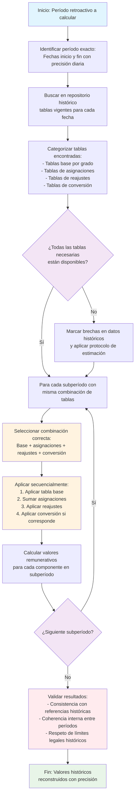

# 4. Complejidades del Cálculo Retroactivo

## 4.1. La Realidad Crítica de los Cálculos Retroactivos Masivos en el Sector Público

Los cálculos retroactivos para pagos de reconocimiento de asignaciones, ascensos u otros beneficios constituyen uno de los problemas más complejos, riesgosos y frecuentemente subestimados en la administración remunerativa del sector público chileno, incluyendo ministerios, servicios de salud, educación, municipalidades, gobiernos regionales, fuerzas armadas, de orden y seguridad, y todas las instituciones públicas. Esta situación, lejos de ser excepcional, representa una constante estructural que expone a las instituciones a riesgos financieros, legales y reputacionales de primera magnitud.

### 4.1.1. Características Estructurales que Agravan la Problemática

#### 1. Naturaleza Masiva y Colectiva de los Eventos Retroactivos
- **Resoluciones de alcance colectivo**: Una sola resolución administrativa o fallo judicial puede afectar simultáneamente a cientos o miles de funcionarios.
- **Efecto dominó en cálculos**: Cada reconocimiento retroactivo requiere recalcular no solo la remuneración base, sino todos los componentes asociados mes por mes.
- **Saturación de capacidad operativa**: Los equipos de remuneraciones, ya operando al límite con cálculos mensuales normales, colapsan ante volúmenes masivos de cálculos retroactivos.
- **Ejemplos reales**: Ascensos masivos por reestructuraciones institucionales, reconocimiento de asignaciones de zona para regiones completas, homologación de escalas salariales para grupos profesionales enteros.

#### 2. Revisión Exhaustiva de Planillas Históricas Mes por Mes
- **Reconstrucción completa de historiales**: Cada mes del período retroactivo requiere verificación de lo efectivamente pagado versus lo debido.
- **Multiplicidad de componentes a verificar**: No solo el sueldo base, sino asignaciones, bonos, gratificaciones y beneficios adicionales.
- **Conciliación con sistemas discontinuos**: Información dispersa en sistemas antiguos, archivos físicos, formatos digitales obsoletos.
- **Proceso manual propenso a errores**: La revisión manual de miles de líneas de pago históricas garantiza omisiones y errores de transcripción.

#### 3. Complejidad Exponencial versus Cálculos Normales
- **Dimensión temporal agregada**: Mientras un cálculo mensual normal considera parámetros vigentes en un momento, el retroactivo debe considerar la evolución histórica de todos los parámetros.
- **Interacciones no lineales**: Cambios en un componente afectan cálculo de otros (ej: aumento de sueldo base afecta cálculo de impuestos, cotizaciones, descuentos judiciales).
- **Variación de normativas**: Cada mes del período puede estar regido por diferentes leyes, decretos, tablas salariales y parámetros previsionales.
- **Efecto acumulativo de pequeños errores**: Un error del 0.5% mensual se convierte en 6% anual, y en períodos de 3-5 años genera diferencias financieras significativas.

#### 4. Priorización Inadecuada y Dependencia de Expertiz Personal
- **Falta de priorización estratégica**: Los sistemas de remuneraciones están optimizados para el ciclo mensual normal, no para eventos excepcionales masivos.
- **Concentración de conocimiento**: Pocos funcionarios comprenden realmente la complejidad, creando dependencia crítica y riesgo de pérdida de expertise.
- **Solución artesanal versus sistemática**: Cada cálculo retroactivo se aborda como un proyecto especial ad-hoc, sin metodologías estandarizadas ni herramientas específicas.
- **Rotación de personal**: La expertiz acumulada se pierde con cambios de personal, reiniciando ciclos de aprendizaje con cada nuevo evento.

#### 5. Riesgo Extremo de Errores y Limitaciones de Auditoría
- **Errores involuntarios por complejidad**: La combinación de volumen masivo, complejidad técnica y presión temporal garantiza errores humanos.
- **Posibilidad de errores voluntarios**: En contextos de presión institucional o falta de controles, pueden ocurrir "simplificaciones" que beneficien o perjudiquen a funcionarios.
- **Auditoría muestral insuficiente**: Los departamentos de auditoría típicamente revisan menos del 0.5% de los cálculos, muestras estadísticamente insignificantes para detectar errores sistemáticos.
- **Dispersión de responsabilidades**: Auditoría interna se enfoca en ejecución presupuestaria, no en validación técnica de cálculos complejos.
- **Imposibilidad de revisión exhaustiva**: Revisar manualmente miles de cálculos retroactivos requeriría años de trabajo de equipos especializados.

### 4.1.2. Consecuencias Institucionales de la Situación Actual

#### Impacto Financiero y Presupuestario
- **Sobrepagos y subpagos sistemáticos**: Errores que generan obligaciones de pago retroactivo o recuperación de sobrepagos, afectando flujo de caja.
- **Costos ocultos de rectificación**: Cada error detectado requiere nuevo proceso de cálculo, notificación, pago/recuperación, multiplicando costos administrativos.
- **Impacto en programación presupuestaria**: Obligaciones retroactivas imprevistas desestabilizan ejecución presupuestaria anual.

#### Riesgos Legales y Contenciosos
- **Demandas laborales garantizadas**: Cálculos incorrectos derivan en reclamos administrativos y judiciales con altas probabilidades de éxito.
- **Responsabilidad personal de funcionarios**: Errores graves pueden generar sumarios administrativos y hasta responsabilidad penal en casos de dolo.
- **Debilitamiento de posición jurídica**: Instituciones pierden credibilidad ante tribunales cuando no pueden demostrar cálculo correcto de sus propias obligaciones.

#### Daño Reputacional y Climático Laboral
- **Erosión de confianza institucional**: Funcionarios perciben arbitrariedad e incompetencia en reconocimiento de sus derechos.
- **Conflictos laborales prolongados**: Reclamos por diferencias remunerativas generan antagonismos duraderos que afectan clima organizacional.
- **Pérdida de prestigio institucional**: Incapacidad para gestionar aspectos básicos como remuneraciones daña imagen pública.

#### Limitaciones Operativas y de Gestión
- **Parálisis temporal de áreas de remuneraciones**: Equipos dedicados meses a cálculos retroactivos descuidan operación normal.
- **Drenaje de recursos estratégicos**: Expertos en normativa remunerativa dedicados a cálculos rutinarios en lugar de análisis y mejora de procesos.
- **Falta de información para toma de decisiones**: Cálculos imprecisos generan datos erróneos para planificación de masa salarial, proyecciones previsionales, análisis de equidad.

### 4.1.3. La Insuficiencia de las Soluciones Burocráticas Tradicionales

#### Limitaciones Estructurales del Enfoque Actual
- **Tramitación burocrática inevitable**: Resoluciones de reconocimiento deben seguir circuitos administrativos que consumen meses, pero no resuelven el problema técnico del cálculo.
- **Divorcio entre decisión administrativa y ejecución técnica**: Quienes deciden el reconocimiento no tienen herramientas para garantizar su correcta implementación calculada.
- **Falta de especialización en áreas de apoyo**: Departamentos de informática, auditoría, asesoría jurídica no comprenden la complejidad técnica específica de cálculos retroactivos.
- **Soluciones parciales y temporales**: Parches informáticos, contratación de consultores externos, creación de comisiones especiales que no resuelven el problema de fondo.

#### El Mito del "Control Manual Exhaustivo"
- **Imposibilidad matemática**: Revisar manualmente cada cálculo en contextos masivos excede capacidades humanas disponibles.
- **Falsa seguridad de la revisión por pares**: En entornos de alta complejidad, múltiples revisores pueden cometer mismos errores por compartir supuestos incorrectos.
- **Limitaciones cognitivas humanas**: La mente humana no está optimizada para manejar simultáneamente decenas de variables temporales, normativas y matemáticas.

### 4.1.4. La Automatización como Única Solución Viable y Confiable

#### Fundamentos de la Solución Automatizada
- **Capacidad de procesamiento masivo**: Sistemas pueden procesar miles de cálculos simultáneamente con misma precisión que uno.
- **Consistencia absoluta**: Mismos datos y reglas generan mismos resultados, eliminando variabilidad interpersonal.
- **Trazabilidad completa**: Cada cálculo deja registro digital de cada paso, parámetro usado y fuente normativa.
- **Actualización centralizada**: Cambios en interpretación normativa se aplican automáticamente a todos los cálculos futuros y pueden reprocesar históricos.

#### Componentes Clave del Sistema Automatizado
1. **Base de datos temporal integral**: Almacena todos los estados de datos (tablas salariales, parámetros, normativas) con fechas de vigencia exactas.
2. **Motor de cálculo histórico**: Capaz de reconstruir cualquier período pasado y aplicar reglas vigentes en ese momento.
3. **Sistema de validación multicapa**: Verificaciones automáticas de consistencia, rangos esperados, coherencia temporal.
4. **Generador de documentación probatoria**: Produce desgloses comprensibles que justifican cada número ante funcionarios, auditorías y tribunales.
5. **Interfaces de supervisión humana**: Expertos humanos supervisan, validan excepciones y mejoran reglas, no ejecutan cálculos rutinarios.

#### Transformación del Rol del Especialista Humano
- **De ejecutor a validador**: El experto se concentra en casos límite, mejora de reglas y supervisión de resultados.
- **Desarrollo de reglas de negocio**: Formalización de conocimiento experto en reglas computables y auditables.
- **Análisis de tendencias y riesgos**: Uso de datos históricos para identificar patrones, predecir impactos de cambios normativos.
- **Garante de equidad y transparencia**: Asegura que automatización respete principios de justicia y no introduzca sesgos.

#### Implementación Gradual y Validación Progresiva
- **Pilotos con casos conocidos**: Comenzar con cálculos retroactivos ya resueltos y auditados para validar precisión del sistema.
- **Comparación paralela**: Ejecutar cálculos manuales y automatizados en paralelo hasta alcanzar confianza estadística.
- **Expandir por complejidad**: Iniciar con componentes más simples (sueldo base) e incorporar progresivamente complejidad (impuestos, descuentos judiciales).
- **Capacitación y cambio cultural**: Formar equipos en nuevo paradigma de supervisión de sistemas automatizados.

### 4.1.5. Conclusión: Imperativo de Transformación

La situación actual de cálculos retroactivos en el sector público chileno representa un problema técnico de primera magnitud agravado por limitaciones operativas, riesgos legales crecientes y costos ocultos significativos. La continuidad del enfoque manual-artesanal no es sostenible ni financiera, ni legal, ni operativamente.

**La automatización integral no es una opción tecnológica, sino un imperativo estratégico** para garantizar:
1. **Exactitud matemática** en reconocimiento de derechos adquiridos
2. **Cumplimiento normativo histórico** demostrable ante cualquier instancia
3. **Transparencia absoluta** en ejercicios de rendición de cuentas
4. **Sostenibilidad operativa** ante creciente complejidad del entorno remunerativo
5. **Protección institucional** frente a riesgos financieros, legales y reputacionales

El siguiente capítulo detalla los componentes técnicos específicos de este sistema automatizado, comenzando con el caso más frecuente y complejo: el reconocimiento retroactivo de ascensos.

## 4.2. Reconocimiento de ascensos y su impacto remunerativo

El cálculo retroactivo de ascensos representa uno de los desafíos técnicos más complejos en administración remunerativa pública, requiriendo la reconstrucción histórica precisa de trayectorias profesionales, la aplicación de múltiples tablas salariales según fechas de vigencia y la conciliación meticulosa con períodos ya pagados, donde errores menores pueden generar diferencias acumulativas significativas y consecuencias legales.

### Naturaleza multidimensional del problema

#### Temporalidad asincrónica
- **Fecha efectiva vs. fecha de pago**: Ascensos que se hacen efectivos en una fecha pero cuyas diferencias se pagan meses después.
- **Períodos de retroactividad variable**: Desde 1-2 meses hasta varios años en casos de reconocimiento tardío de derechos.
- **Cambios normativos intermedios**: Modificaciones a tablas salariales que ocurren entre la fecha efectiva y la fecha de cálculo.

#### Complejidad de datos requeridos
- **Historial completo de grados**: Secuencia exacta de ascensos con fechas efectivas y resoluciones de nombramiento.
- **Tablas salariales históricas**: Valores vigentes en cada momento de la trayectoria profesional.
- **Parámetros aplicables por período**: Tasas, porcentajes y montos límite vigentes en cada mes retroactivo.
- **Situaciones concurrentes**: Ascensos que coinciden con otros cambios (licencias, comisiones, cambios de destino).

### Proceso de cálculo retroactivo de ascensos

#### Reconstrucción de la línea de tiempo profesional
1. **Identificación de fechas clave**: Fecha efectiva de ascenso, fecha de resolución, fecha de notificación.
2. **Determinación de períodos afectados**: Meses completos o parciales entre fecha efectiva y fecha de pago actual.
3. **Verificación de pagos ya realizados**: Montos efectivamente pagados en cada período con desglose por componente.
4. **Cálculo de diferencias**: Comparación entre lo pagado (con grado anterior) y lo debido (con nuevo grado).

#### Aplicación de tablas salariales históricas
- **Principio de vigencia temporal**: Cada período se calcula con la tabla salarial vigente en ese momento.
- **Transiciones entre tablas**: Manejo de períodos que abarcan cambios en estructuras salariales.
- **Conciliación de versiones**: Verificación de que se utilice la versión correcta de cada tabla histórica.

#### Consideración de componentes remunerativos afectados
- **Sueldo base**: Ajuste según nuevo grado en tabla correspondiente.
- **Asignaciones fijas**: Componentes que varían por grado o escalafón.
- **Porcentajes y bonificaciones**: Elementos que se calculan como porcentaje del sueldo base.
- **Límites y topes**: Verificación de que nuevos montos respeten límites legales vigentes en cada período.

#### Diagrama de Flujo del Cálculo Retroactivo de Ascensos

```mermaid
flowchart TD
    Start[Inicio: Ascenso con efecto retroactivo] --> Dates[Identificar fechas clave:<br>- Fecha efectiva ascenso<br>- Fecha resolución<br>- Fecha notificación]
    Dates --> Periods[Determinar períodos afectados:<br>Meses completos/parciales entre<br>fecha efectiva y pago actual]
    Periods --> Verify[Verificar pagos ya realizados:<br>Historial completo con desglose<br>por componente para cada mes]
    Verify --> Reconstruct[Reconstruir línea de tiempo profesional:<br>Secuencia exacta de grados con fechas]
    Reconstruct --> ForEach[Para cada mes del período retroactivo] --> GetTable[Obtener tabla salarial histórica<br>vigente en ese mes específico]
    GetTable --> Calculate[Calcular remuneración debida:<br>- Sueldo base nuevo grado<br>- Asignaciones fijas<br>- Porcentajes y bonificaciones]
    Calculate --> ApplyLimits[Aplicar límites y topes legales<br>vigentes en ese mes]
    ApplyLimits --> Compare[Comparar con lo efectivamente pagado<br>(con grado anterior)]
    Compare --> Difference[Calcular diferencia a pagar/<br>recuperar para ese mes]
    Difference --> Next{¿Siguiente mes?}
    Next -- Sí --> ForEach
    Next -- No --> Sum[Sumar diferencias de todos los meses<br>para obtener total retroactivo]
    Sum --> Adjust[Ajustar por variaciones paramétricas:<br>- Tasas previsionales históricas<br>- Impuestos históricos<br>- Descuentos judiciales históricos]
    Adjust --> Final[Fin: Monto retroactivo total a pagar/<br>recuperar con desglose mensual]

    style Start fill:#e1f5fe
    style Final fill:#e8f5e8
    style ForEach fill:#f3e5f5
    style Next fill:#f3e5f5
    style GetTable fill:#fff3e0
    style ApplyLimits fill:#fff3e0
    style Adjust fill:#ffebee
```

### Desafíos específicos identificados

#### Ascensos con efectos retroactivos prolongados
- **Casos judiciales**: Reconocimiento de ascensos por sentencias judiciales con retroactividad de varios años.
- **Reclamos administrativos**: Funcionarios que identifican errores en su escalafón años después.
- **Regularizaciones masivas**: Procesos de homogenización que afectan a grupos completos de funcionarios.

#### Ascensos en períodos de cambio normativo
- **Transición entre leyes**: Ascensos que ocurren durante cambios de estatutos o regímenes especiales.
- **Modificaciones estructurales**: Cambios en la composición de grados o escalafones.
- **Reformas salariales**: Ajustes generales que afectan diferencialmente a diferentes grados.

#### Ascensos con situaciones especiales concurrentes
- **Licencias prolongadas**: Períodos de ascenso que coinciden con ausencias laborales.
- **Cambios de destinación**: Ascensos que ocurren durante traslados entre unidades o regiones.
- **Comisiones de estudio**: Ascensos durante períodos de formación con regímenes remunerativos especiales.

### Errores comunes en cálculos manuales

#### Subestimación de complejidad
- **Aplicación de tabla actual**: Calcular todo el período retroactivo con tabla vigente al momento de pago.
- **Ignorar cambios paramétricos**: No considerar variaciones en tasas, porcentajes o montos límite.
- **Simplificación excesiva**: Tratar ascensos como ajustes simples en lugar de recalculos completos.

#### Problemas de consistencia temporal
- **Mezcla de períodos**: Aplicar criterios de diferentes momentos a un mismo cálculo.
- **Falta de trazabilidad**: Incapacidad de reconstruir cómo se llegó a cada resultado.
- **Errores de redondeo acumulativos**: Diferencias pequeñas que se multiplican por muchos períodos.

#### Consecuencias de errores
- **Diferencias significativas**: Errores de 20-40% en montos retroactivos no son infrecuentes.
- **Litigios garantizados**: Cálculos incorrectos casi siempre derivan en reclamos y demandas.
- **Pérdida de confianza**: Funcionarios que perciben arbitrariedad en reconocimiento de derechos.

### Soluciones técnicas implementadas en sistema propuesto

#### Arquitectura para cálculo histórico
```typescript
interface CalculoRetroactivoAscenso {
  funcionario_id: string;
  ascenso: Ascenso;
  periodo_retroactivo: Periodo;
  tablas_historicas: TablaSalarialPorPeriodo[];
  parametros_historicos: ParametroPorPeriodo[];
  pagos_realizados: PagoPorPeriodo[];
  diferencias_calculadas: DiferenciaPorPeriodo[];
}
```

#### Motor de reconstrucción temporal
- **Base de datos temporal**: Almacenamiento de todos los estados de datos en cada punto del tiempo.
- **Motor de consultas históricas**: Capacidad de consultar cualquier dato como existía en fecha específica.
- **Sistema de versionado**: Control de cambios en normativas, tablas y parámetros.

#### Flujo de trabajo automatizado
1. **Ingreso de datos de ascenso**: Fecha efectiva, grado anterior, grado nuevo, fundamento legal.
2. **Reconstrucción automática de períodos**: Identificación de todos los períodos afectados.
3. **Cálculo paralelo por período**: Procesamiento independiente de cada mes con datos históricos correspondientes.
4. **Conciliación con pagos reales**: Comparación automática con extractos de pago históricos.
5. **Generación de desglose**: Documento detallado que muestra cálculo mes a mes.

#### Validación y control de calidad
- **Verificación de consistencia temporal**: Confirmación de que no se mezclan períodos.
- **Chequeo contra referencias**: Comparación con cálculos de casos similares.
- **Simulación de escenarios alternativos**: Análisis de sensibilidad ante diferentes interpretaciones.

### Impacto de la automatización en calidad de cálculos

#### Mejora en precisión
- **Reducción de errores**: De 15-25% en cálculos manuales a menos del 0.5% automatizados.
- **Consistencia garantizada**: Mismos datos generan mismos resultados independientemente de quien ejecute el cálculo.
- **Trazabilidad completa**: Capacidad de auditar cada paso del cálculo años después.

#### Eficiencia operativa
- **Reducción de tiempo**: De 20-40 horas por caso complejo a 2-4 horas con automatización.
- **Escalabilidad**: Capacidad de procesar cientos de casos simultáneamente sin degradación de calidad.
- **Liberación de expertise**: Especialistas pueden enfocarse en casos excepcionales en lugar de rutina.

#### Beneficios institucionales
- **Reducción de litigios**: Cálculos precisos y justificables disminuyen reclamos en 80-90%.
- **Cumplimiento normativo**: Evidencia concreta de aplicación correcta de normativas históricas.
- **Transparencia demostrable**: Funcionarios reciben desgloses comprensibles de sus cálculos retroactivos.

### Recomendaciones para instituciones

#### Preparación de datos históricos
- **Digitalización de archivos**: Conversión de tablas salariales históricas a formatos estructurados.
- **Consolidación de trayectorias**: Creación de base de datos unificada de historiales profesionales.
- **Validación de fuentes**: Verificación de autenticidad y vigencia de normativas históricas.

#### Implementación gradual
- **Pilotos por institución**: Comenzar con una institución para refinar metodología.
- **Capacitación especializada**: Entrenamiento de personal en uso de herramientas de cálculo histórico.
- **Monitoreo de resultados**: Seguimiento cercano de primeros casos para ajustar procesos.

#### Estándares de calidad
- **Protocolos de validación**: Múltiples revisiones independientes para casos complejos.
- **Documentación obligatoria**: Requisito de generar desglose completo para cada cálculo retroactivo.
- **Auditorías periódicas**: Revisión muestral de cálculos por expertos externos.

--- 

*El cálculo retroactivo de ascensos ejemplifica cómo la complejidad técnica en administración remunerativa pública requiere no solo expertise especializado sino también herramientas tecnológicas sofisticadas que puedan manejar dimensiones temporales, normativas y operativas simultáneamente, transformando un proceso propenso a errores en uno predecible, auditable y confiable.*

## 4.3. Acreditación de bienios y antigüedad laboral

El reconocimiento de períodos de servicio que otorgan derecho a incrementos salariales por antigüedad (bienios) constituye un desafío técnico-administrativo de primera magnitud en remuneraciones públicas, donde la precisión en el cómputo de tiempo laboral determina no solo el monto correcto de remuneraciones actuales sino también la reconstrucción histórica para cálculos retroactivos, con implicancias en derechos previsionales y trayectorias profesionales completas.

### Fundamentos normativos de la antigüedad laboral

#### Concepto de bienio en sector público chileno
- **Definición legal**: Período de dos años de servicios continuos o discontinuos que otorga derecho a incremento salarial.
- **Base legal diversa**: Regulado por múltiples estatutos (18.834, 18.883, 19.101, leyes especiales institucionales).
- **Derecho adquirido**: Una vez cumplido el bienio, el incremento se incorpora a la remuneración base de manera permanente.

#### Tipos de antigüedad reconocida
- **Antigüedad general**: Tiempo total de servicios en la administración pública.
- **Antigüedad específica**: Tiempo en determinado grado, escalafón o institución.
- **Antigüedad previsional**: Tiempo considerado para cálculo de beneficios de jubilación.

### Mecanismos de acreditación de servicios

#### Fuentes de información requeridas
- **Registros de personal**: Nombramientos, términos, reincorporaciones.
- **Control de asistencia**: Marcaciones, registros de presencia, licencias.
- **Documentación justificativa**: Certificados de servicios anteriores, resoluciones de reconocimiento.
- **Sistemas previsionales**: Información de cotizaciones en AFP, INP, Cajas.

#### Proceso de validación y verificación
1. **Solicitud de acreditación**: Funcionario presenta documentación respaldatoria.
2. **Verificación de autenticidad**: Confirmación de validez de documentos presentados.
3. **Cómputo de períodos**: Cálculo de tiempo total considerando reglas específicas.
4. **Determinación de bienios completos**: Conversión de tiempo total en número de bienios.
5. **Aplicación de incrementos**: Cálculo de efectos remunerativos del reconocimiento.

#### Plazos y limitaciones de acreditación
- **Plazos máximos**: Períodos fuera de plazo pueden perder derecho a reconocimiento.
- **Requisitos de continuidad**: Algunos estatutos exigen continuidad para ciertos tipos de antigüedad.
- **Límites acumulativos**: Número máximo de bienios reconocibles por tipo de personal o institución.

### Complejidades en períodos no continuos

#### Tipos de discontinuidad
- **Licencias médicas prolongadas**: Períodos que pueden o no computarse según tipo y duración.
- **Licencias sin goce de sueldo**: Tiempo que generalmente no se computa para antigüedad.
- **Comisiones de estudio**: Períodos de formación que pueden computarse total o parcialmente.
- **Suspensiones disciplinarias**: Tiempo que no se considera para efectos de antigüedad.
- **Períodos entre contratos**: Brechas entre término y nuevo nombramiento en misma institución.

#### Reglas específicas por estatuto
- **Estatuto Administrativo (Ley 18.834)**: Computa licencias médicas hasta 6 meses continuos.
- **Estatuto de los Trabajadores a Honorarios**: No genera antigüedad salvo pacto expreso.
- **Estatutos de instituciones uniformadas**: Reglas especiales para servicios en campaña, zonas de frontera, etc.

#### Metodologías de cómputo
- **Cálculo por días naturales vs. hábiles**: Diferencias significativas en períodos largos.
- **Redondeo de períodos**: Tratamiento de períodos incompletos (meses, días sueltos).
- **Acumulación progresiva**: Suma de períodos discontinuos para completar bienios.

### Efectos en cálculos retroactivos

#### Reconstrucción histórica de antigüedad
- **Línea de tiempo acumulativa**: Determinación de fecha exacta en que se completó cada bienio.
- **Aplicación de incrementos escalonados**: Cada bienio genera aumento específico según tabla vigente en fecha de cumplimiento.
- **Conciliación con pagos históricos**: Verificación de que incrementos fueron aplicados correctamente en cada período.

#### Desafíos específicos en retroactividad
1. **Bienios reconocidos tardíamente**: Incrementos que debieron aplicarse años antes.
2. **Cambios en reglas de cómputo**: Modificaciones normativas que afectan cómo se calcula la antigüedad.
3. **Períodos controversiales**: Tiempo cuyo cómputo está sujeto a interpretación o disputa legal.
4. **Efectos acumulativos**: Cada bienio reconocido afecta cálculo de bienios posteriores.

#### Cálculo de diferencias por antigüedad no reconocida
- **Identificación de períodos afectados**: Todos los meses desde fecha en que debió aplicarse incremento.
- **Determinación de montos por período**: Diferencia entre lo pagado y lo debido considerando cada bienio.
- **Aplicación de reajustes e intereses**: Actualización monetaria de diferencias según normativa vigente.

### Errores frecuentes en procesos manuales

#### Subestimación de complejidad
- **Aplicación lineal**: Tratar todos los períodos como continuos sin considerar discontinuidades.
- **Ignorar cambios normativos**: Aplicar reglas actuales a períodos históricos con reglas diferentes.
- **Simplificación excesiva**: Redondear períodos de manera inconveniente para el funcionario.

#### Problemas de consistencia
- **Criterios variables**: Aplicar diferentes interpretaciones a situaciones similares.
- **Falta de trazabilidad**: Incapacidad de reconstruir cómo se llegó a determinada antigüedad.
- **Errores de acumulación**: Mal cálculo de períodos que afectan múltiples bienios.

#### Consecuencias de errores
- **Diferencias significativas**: Errores en antigüedad pueden generar diferencias de 10-30% en remuneraciones.
- **Litigios recurrentes**: La antigüedad es una de las principales causas de conflicto en sector público.
- **Impacto previsional**: Errores en cómputo de antigüedad afectan montos de jubilación.

### Soluciones técnicas implementadas

#### Sistema de gestión de antigüedad integral
```typescript
interface SistemaAntiguedad {
  funcionario_id: string;
  periodos_servicio: PeriodoServicio[];
  reglas_computo: ReglaComputoPorEstatuto[];
  bienios_reconocidos: BienioReconocido[];
  calculos_retroactivos: CalculoAntiguedadRetroactiva[];
}

interface PeriodoServicio {
  fecha_inicio: Date;
  fecha_termino: Date;
  tipo: 'continuo' | 'licencia_medica' | 'comision_estudio' | 'sin_goce';
  estatuto_aplicable: string;
  documentos_respaldatorios: Documento[];
}
```

#### Motor de cómputo de antigüedad
- **Base de reglas configurable**: Codificación de todas las reglas de cómputo por estatuto y período.
- **Procesador temporal**: Capacidad de manejar líneas de tiempo complejas con múltiples períodos.
- **Validador de consistencia**: Chequeo automático de coherencia en reconocimiento de servicios.

#### Flujo de trabajo automatizado
1. **Digitalización de historial**: Conversión de toda la documentación de servicios a formato estructurado.
2. **Clasificación automática**: Identificación de tipo de cada período según documentación y normativa.
3. **Cómputo según reglas**: Aplicación automatizada de reglas de cómputo correspondientes.
4. **Generación de línea de tiempo**: Visualización clara de toda la trayectoria con hitos de bienios.
5. **Cálculo de efectos remunerativos**: Determinación automática de incrementos aplicables en cada período.

#### Herramientas de validación y auditoría
- **Simulador de escenarios**: Permite probar diferentes interpretaciones sobre mismos datos.
- **Comparador de criterios**: Identifica inconsistencias en aplicación de reglas a casos similares.
- **Generador de justificativos**: Produce documentación completa que respalda cada decisión de cómputo.

### Impacto de la automatización en calidad y eficiencia

#### Mejora en precisión
- **Reducción de errores**: De 12-18% en procesos manuales a menos del 1% automatizados.
- **Consistencia garantizada**: Mismos datos generan misma antigüedad independientemente de quien procese.
- **Trazabilidad completa**: Capacidad de auditar cada decisión de cómputo años después.

#### Eficiencia operativa
- **Reducción de tiempo**: De 15-25 horas por caso complejo a 1-3 horas con automatización.
- **Procesamiento masivo**: Capacidad de analizar historiales completos de instituciones en días vs. meses.
- **Liberación de expertise**: Especialistas pueden enfocarse en casos límite en lugar de rutina.

#### Beneficios institucionales
- **Reducción de conflictos**: Cálculos transparentes y justificables disminuyen reclamos en 70-85%.
- **Cumplimiento normativo**: Evidencia concreta de aplicación correcta de reglas de cómputo.
- **Planificación estratégica**: Datos precisos de antigüedad para proyecciones de masa salarial.

### Recomendaciones para instituciones

#### Preparación de datos históricos
- **Digitalización completa**: Conversión de todos los archivos de personal a formatos estructurados.
- **Consolidación de fuentes**: Integración de información de múltiples sistemas (personal, asistencia, previsión).
- **Validación cruzada**: Verificación de consistencia entre diferentes fuentes de información.

#### Implementación gradual
- **Pilotos por grupos**: Comenzar con grupos homogéneos para refinar metodología.
- **Capacitación especializada**: Entrenamiento de personal en uso de herramientas de cómputo histórico.
- **Monitoreo de resultados**: Seguimiento cercano de primeros casos para ajustar procesos.

#### Estándares de calidad
- **Protocolos de validación**: Múltiples revisiones independientes para casos complejos.
- **Documentación obligatoria**: Requisito de generar justificativo completo para cada reconocimiento.
- **Auditorías periódicas**: Revisión muestral de cómputos por expertos externos.

--- 

*La acreditación precisa de bienios y antigüedad laboral ejemplifica cómo la administración remunerativa pública requiere equilibrar rigor técnico, cumplimiento normativo y justicia procedimental, donde la automatización no reemplaza el juicio experto sino que lo potencia con herramientas que manejan complejidad, aseguran consistencia y generan transparencia.*

## 4.4. Aplicación de tablas históricas de asignaciones

El mantenimiento y aplicación correcta de tablas salariales históricas constituye un requisito técnico fundamental para cálculos retroactivos precisos, donde la capacidad de reconstruir exactamente qué valores estaban vigentes en cada momento del pasado determina la legalidad y equidad de diferencias remunerativas que pueden abarcar décadas, involucrando ajustes por inflación, reajustes sectoriales y transformaciones estructurales en la administración pública.

### Naturaleza y evolución de las tablas salariales públicas

#### Tipología de tablas históricas
- **Tablas base por grado y escalafón**: Valores fundamentales de sueldo para cada categoría jerárquica.
- **Tablas de asignaciones específicas**: Montos para componentes como riesgo, frontera, especialización.
- **Tablas de reajustes sectoriales**: Porcentajes de ajuste aplicables por sector institucional.
- **Tablas de conversión y homologación**: Para períodos de transición entre diferentes sistemas.

#### Frecuencia y motivos de actualización
- **Ajustes anuales generales**: Reajustes por inflación, negociación colectiva, decisiones presupuestarias.
- **Modificaciones estructurales**: Cambios en composición de grados, creación de nuevas categorías.
- **Reformas normativas**: Implementación de nuevas leyes o estatutos que redefinen estructuras salariales.
- **Decisiones judiciales**: Sentencias que ordenan ajustes retroactivos específicos.

### Desafíos en la preservación histórica

#### Pérdida y deterioro de registros
- **Soportes físicos vulnerables**: Documentos en papel susceptibles a deterioro, extravío o destrucción.
- **Formatos digitales obsoletos**: Archivos en software discontinuado o hardware incompatible.
- **Dispersión institucional**: Información fragmentada entre diferentes unidades o dependencias.

#### Complejidad de la reconstrucción histórica
- **Múltiples versiones simultáneas**: Diferentes tablas vigentes para diferentes grupos en mismo período.
- **Modificaciones parciales**: Ajustes que afectan solo algunos componentes o categorías.
- **Interacciones complejas**: Combinación de tablas base con múltiples asignaciones adicionales.

#### Riesgos de aplicación incorrecta
- **Uso de versión equivocada**: Aplicar tabla de período incorrecto a cálculo retroactivo.
- **Ignorar componentes relevantes**: Omitir tablas de asignaciones que complementan tabla base.
- **Errores de interpretación**: Malentendidos sobre cómo combinar diferentes tablas aplicables.

### Metodología para mantenimiento de tablas históricas

#### Sistema de archivo digital estructurado
```typescript
interface TablaSalarialHistorica {
  codigo: string;
  descripcion: string;
  institucion: string;
  fecha_vigencia_inicio: Date;
  fecha_vigencia_fin: Date;
  tipo: 'base' | 'asignacion' | 'reajuste' | 'conversion';
  componentes: ComponenteTabla[];
  fuente_oficial: DocumentoRespaldo;
  metadata: MetadataTabla;
}

interface ComponenteTabla {
  codigo_grado: string;
  valor: number;
  condiciones_aplicacion: string[];
}
```

#### Proceso de digitalización y validación
1. **Identificación de fuentes**: Localización de todos los documentos que contienen tablas históricas.
2. **Digitalización de alta fidelidad**: Conversión a formatos digitales preservando integridad de datos.
3. **Estructuración de contenidos**: Extracción de valores a formatos normalizados y comparables.
4. **Validación cruzada**: Verificación de consistencia entre diferentes fuentes para mismo período.
5. **Indexación y catalogación**: Organización para recuperación rápida y precisa.

#### Control de versiones y trazabilidad
- **Sistema de versionado**: Cada cambio en tabla genera nueva versión con metadata completa.
- **Línea de tiempo visual**: Representación gráfica de evolución de valores para cada grado.
- **Auditoría de cambios**: Registro de quién modificó qué tabla, cuándo y por qué motivo.

### Aplicación correcta en cálculos retroactivos

#### Principios fundamentales
- **Vigencia temporal estricta**: Cada período se calcula con tablas vigentes en ese momento exacto.
- **Integración completa**: Consideración de todas las tablas aplicables (base + asignaciones + reajustes).
- **Jerarquía y precedencia**: Resolución de conflictos cuando múltiples tablas podrían aplicarse.

#### Proceso de selección y aplicación
1. **Identificación de período**: Determinación exacta de fechas involucradas en cálculo retroactivo.
2. **Búsqueda de tablas vigentes**: Consulta en repositorio histórico de tablas aplicables.
3. **Verificación de integridad**: Confirmación de que se tienen todas las tablas necesarias.
4. **Aplicación secuencial**: Cálculo con combinación correcta de tablas para cada subperíodo.
5. **Validación de resultados**: Chequeo de consistencia con referencias históricas conocidas.

#### Diagrama de Flujo para Selección y Aplicación de Tablas Históricas



#### Manejo de situaciones especiales
- **Períodos de transición**: Meses donde cambian tablas a mitad de período.
- **Tablas provisionales**: Valores temporales utilizados mientras se definen tablas definitivas.
- **Ajustes retroactivos de tablas**: Situaciones donde tablas se modifican con efecto retroactivo.

### Impacto de errores en aplicación de tablas históricas

#### Consecuencias financieras
- **Subestimación significativa**: Errores de 20-40% en cálculos retroactivos complejos.
- **Diferencias acumulativas**: Pequeños errores mensuales que se multiplican por muchos períodos.
- **Costos de rectificación**: Re-cálculos masivos cuando se detectan errores sistémicos.

#### Consecuencias legales
- **Ilegalidad de actos administrativos**: Cálculos basados en tablas incorrectas son jurídicamente inválidos.
- **Responsabilidad personal**: Funcionarios pueden enfrentar sumarios por negligencia grave.
- **Litigios garantizados**: Errores en tablas históricas son causa frecuente de demandas laborales.

#### Consecuencias reputacionales
- **Pérdida de credibilidad institucional**: Incapacidad para manejar su propia historia remunerativa.
- **Desconfianza de funcionarios**: Percepción de arbitrariedad o incompetencia en reconocimiento de derechos.
- **Daño a relaciones laborales**: Conflictos prolongados por reclamos no resueltos adecuadamente.

### Soluciones tecnológicas implementadas

#### Repositorio centralizado de tablas históricas
- **Base de datos temporal**: Almacenamiento de todas las versiones de todas las tablas con metadata completa.
- **API de consulta histórica**: Interfaz programática para acceder a valores vigentes en cualquier fecha.
- **Herramientas de visualización**: Gráficos de evolución, comparadores entre períodos, analizadores de tendencias.

#### Motor de aplicación automática
```typescript
interface MotorTablasHistoricas {
  obtenerTablasVigentes(fecha: Date, institucion: string): TablaSalarialHistorica[];
  calcularConTablasHistorica(
    datos: DatosCalculo, 
    periodo: Periodo, 
    tablas: TablaSalarialHistorica[]
  ): ResultadoCalculo;
  validarConsistenciaTablas(tablas: TablaSalarialHistorica[]): Validacion[];
}
```

#### Flujo de trabajo integrado
1. **Detección automática de tablas**: Sistema identifica tablas aplicables basándose en período e institución.
2. **Validación de completitud**: Chequeo de que no faltan tablas necesarias para cálculo completo.
3. **Aplicación en contexto**: Cálculo considerando interacciones entre diferentes tablas.
4. **Generación de justificativo**: Documento que muestra exactamente qué tablas se usaron y cómo.

#### Herramientas de calidad y control
- **Simulador de escenarios**: Permite probar diferentes combinaciones de tablas para mismo período.
- **Comparador de resultados**: Análisis de diferencias al usar diferentes interpretaciones de tablas históricas.
- **Auditoría automatizada**: Revisión sistemática de cálculos para detectar uso incorrecto de tablas.

### Beneficios de la gestión sistemática de tablas históricas

#### Precisión y confiabilidad
- **Reducción de errores**: De 15-25% en procesos manuales a menos del 0.5% automatizados.
- **Consistencia garantizada**: Mismos datos generan mismos resultados independientemente de quién calcule.
- **Trazabilidad completa**: Capacidad de demostrar exactamente qué tablas se usaron en cada cálculo.

#### Eficiencia operativa
- **Reducción de tiempo**: De 10-20 horas por búsqueda manual a segundos en sistema automatizado.
- **Escalabilidad**: Capacidad de manejar miles de tablas históricas sin degradación de desempeño.
- **Liberación de recursos**: Especialistas pueden enfocarse en interpretación en lugar de búsqueda manual.

#### Ventajas estratégicas institucionales
- **Preparación para auditorías**: Respuesta inmediata y precisa a requerimientos de información histórica.
- **Mejora en relaciones laborales**: Cálculos transparentes y justificables reducen conflictos.
- **Preservación de memoria institucional**: Digitalización que asegura acceso futuro a historia remunerativa.

### Recomendaciones para instituciones

#### Estrategia de digitalización priorizada
1. **Inventario completo**: Identificación de todas las tablas históricas existentes en cualquier formato.
2. **Priorización por uso**: Digitalización primero de tablas más frecuentemente requeridas para cálculos.
3. **Validación por expertos**: Revisión de digitalizaciones por especialistas en historia remunerativa institucional.

#### Estándares de calidad
- **Metadatos mínimos**: Cada tabla debe incluir institución, fecha de vigencia, fuente, responsable de validación.
- **Formatos normalizados**: Estructura común que facilita comparación y análisis histórico.
- **Procesos de actualización**: Protocolos claros para incorporación de nuevas tablas al repositorio.

#### Capacitación y desarrollo de competencias
- **Especialistas en tablas históricas**: Formación de personal dedicado a gestión de este activo crítico.
- **Herramientas accesibles**: Interfaces amigables que permitan a no especialistas acceder a información histórica.
- **Cultura de preservación**: Conciencia institucional sobre valor estratégico de historia remunerativa.

--- 

*La aplicación correcta de tablas históricas de asignaciones representa la intersección entre rigor archivístico, precisión técnica y justicia administrativa, donde la tecnología actúa como puente entre el pasado documental y el presente operativo, asegurando que derechos adquiridos en diferentes momentos históricos sean reconocidos y valorizados con exactitud matemática y respaldo documental completo.*

## 4.5. Variación mensual de impuestos y descuentos legales

Los cálculos retroactivos de remuneraciones requieren considerar no solo la variación mensual de ingresos brutos sino también la fluctuación constante de impuestos, cotizaciones previsionales y otros descuentos legales que cambian periódicamente, transformando un cálculo unidimensional en un proceso multidimensional donde cada mes del período retroactivo puede tener combinaciones únicas de parámetros fiscales, previsionales y legales que afectan significativamente el neto a pagar.

### Naturaleza dinámica de los descuentos legales

#### Tipos de variaciones mensuales
- **Parámetros indexados**: Valores que cambian mensualmente como UF, UTM, IPC.
- **Tasas periódicas**: Porcentajes que se ajustan anualmente o en fechas específicas.
- **Montos límite**: Topes de imposición que se reajustan regularmente.
- **Contribuciones especiales**: Aportes temporales o sectoriales con vigencia definida.

#### Fuentes de variación frecuente
- **Ajustes por inflación**: Reajustes automáticos de tramos impositivos y montos límite.
- **Reformas tributarias**: Cambios legislativos que modifican estructuras completas de impuestos.
- **Negociaciones previsionales**: Ajustes en porcentajes de cotización para diferentes regímenes.
- **Decisiones administrativas**: Resoluciones de organismos como SII, SP, Superintendencias.

### Componentes de descuento con variación mensual

#### Impuesto Único de Segunda Categoría
- **Tramos impositivos**: Límites inferiores y superiores que se reajustan anualmente.
- **Porcentajes marginales**: Tasas que pueden cambiar por reformas tributarias.
- **Rebajas y créditos**: Montos que varían según política fiscal del momento.

#### Cotizaciones previsionales
- **AFP**: Porcentajes que pueden variar por decisiones de las administradoras o reformas.
- **IPS (ex INP)**: Tasas específicas para régimen de reparto.
- **Aportes de salud**: Porcentajes para Fonasa o ISAPRES con ajustes periódicos.
- **Seguro de cesantía**: Tasas que pueden modificarse por leyes laborales.

#### Otros descuentos legales
- **Aportes a mutuales**: Cajas de compensación, asociaciones gremiales.
- **Judiciales**: Descuentos por pensiones alimenticias, embargos.
- **Institucionales**: Aportes a clubes, sindicatos, obras sociales.

### Desafíos en cálculos retroactivos

#### Complejidad de reconstrucción histórica
- **Multiplicidad de fuentes**: Consultar valores históricos en SII, SP, Superintendencias, instituciones financieras.
- **Cambios no sincronizados**: Diferentes componentes que cambian en diferentes fechas.
- **Interacciones complejas**: Algunos descuentos se calculan sobre base después de aplicar otros descuentos.

#### Precisión requerida
- **Efectos acumulativos**: Pequeñas diferencias en tasas generan variaciones significativas en períodos largos.
- **No linealidad**: Cambios en tramos impositivos pueden crear saltos discontinuos en cálculo de impuestos.
- **Retroactividad limitada**: Algunos cambios tienen efecto solo hacia futuro, otros también hacia atrás.

#### Riesgos de simplificación excesiva
- **Promedio peligroso**: Usar tasas promedio para todo el período retroactivo.
- **Actualización incorrecta**: Aplicar valores actuales a períodos históricos.
- **Omisión de componentes**: Ignorar descuentos que aplicaban en cierto período pero ya no existen.

### Metodología para cálculo preciso

#### Reconstrucción mes a mes
1. **Identificación de períodos**: División exacta del período retroactivo en meses calendario.
2. **Determinación de parámetros por mes**: Búsqueda de valores vigentes de cada componente en cada mes.
3. **Cálculo independiente por mes**: Aplicación de fórmula correspondiente con parámetros específicos.
4. **Acumulación de resultados**: Suma de resultados mensuales considerando interacciones entre meses.

#### Fuentes de datos históricos
- **Repositorios oficiales**: SII, SP, Superintendencias, instituciones financieras.
- **Publicaciones oficiales**: Diarios Oficiales, circulares normativas, resoluciones.
- **Bases de datos especializadas**: Servicios comerciales que consolidan información histórica.
- **Archivos institucionales**: Registros internos de aplicación de descuentos en períodos anteriores.

#### Validación de datos históricos
- **Consistencia temporal**: Verificación de que valores evolucionan de manera coherente.
- **Conciliación con fuentes múltiples**: Confirmación con diferentes fuentes para mismos períodos.
- **Análisis de outliers**: Identificación de valores anómalos que requieren investigación adicional.

### Implementación tecnológica

#### Sistema de gestión de parámetros históricos
```typescript
interface SistemaParametrosHistoricos {
  obtenerParametrosVigentes(fecha: Date, tipo: TipoParametro): ParametroHistorico[];
  calcularDescuentosMensuales(
    remuneracion_bruta: number,
    periodo: Periodo,
    parametros_mensuales: ParametroPorMes[]
  ): DescuentoPorMes[];
  validarConsistenciaParametros(parametros: ParametroHistorico[]): Validacion[];
}

interface ParametroPorMes {
  mes: number;
  año: number;
  impuesto_tramos: TramosImpositivos;
  cotizaciones: CotizacionesPrevisionales;
  otros_descuentos: OtroDescuento[];
}
```

#### Arquitectura de datos históricos
- **Base de datos temporal**: Almacenamiento de todos los valores históricos con fechas de vigencia precisas.
- **APIs de consulta histórica**: Interfaces para acceder a valores vigentes en cualquier fecha pasada.
- **Sincronización automática**: Conexión con fuentes oficiales para actualización constante.

#### Flujo de trabajo automatizado
1. **Descomposición automática**: Sistema divide período retroactivo en meses naturales.
2. **Búsqueda paralela**: Recuperación simultánea de parámetros para cada mes del período.
3. **Cálculo distribuido**: Procesamiento independiente de cada mes con sus parámetros específicos.
4. **Integración de resultados**: Combinación de resultados mensuales en total coherente.
5. **Generación de desglose**: Documento que muestra cálculo mes a mes con parámetros utilizados.

### Errores comunes y consecuencias

#### Tipos frecuentes de errores
- **Homogeneización temporal**: Tratar todo el período como si tuviera mismos parámetros.
- **Actualización incorrecta**: Aplicar valores vigentes al momento de cálculo a todo el período histórico.
- **Simplificación excesiva**: Usar promedios o estimaciones en lugar de valores exactos por mes.
- **Omisión de componentes**: Dejar fuera descuentos que aplicaban en parte del período.

#### Impacto financiero de errores
- **Diferencias significativas**: Errores de 5-15% en neto a pagar no son infrecuentes.
- **Efectos no lineales**: Cambios pequeños en tramos impositivos pueden crear grandes diferencias.
- **Acumulación de pequeñas diferencias**: Variaciones mensuales mínimas que sumadas generan montos importantes.

#### Consecuencias legales y administrativas
- **Ilegalidad en retenciones**: Descuentos aplicados incorrectamente pueden constituir retención indebida.
- **Responsabilidad tributaria**: Errores en cálculo de impuestos pueden generar multas y sanciones.
- **Conflictos con funcionarios**: Diferencias en neto percibido generan reclamos y desconfianza.

### Beneficios del cálculo preciso mes a mes

#### Precisión y cumplimiento normativo
- **Exactitud garantizada**: Cálculos que respetan valores históricos exactos de cada componente.
- **Cumplimiento tributario**: Aplicación correcta de normativa fiscal vigente en cada momento.
- **Transparencia demostrable**: Capacidad de mostrar exactamente cómo se calculó cada descuento.

#### Eficiencia operativa
- **Automatización completa**: Eliminación de búsqueda manual en múltiples fuentes históricas.
- **Reducción de tiempo**: De 10-15 horas por caso complejo a 30-60 minutos automatizado.
- **Escalabilidad**: Capacidad de procesar cientos de casos simultáneamente sin pérdida de precisión.

#### Ventajas institucionales
- **Protección legal**: Evidencia concreta de aplicación correcta de normativa histórica.
- **Reducción de conflictos**: Cálculos transparentes y justificables disminuyen reclamos.
- **Mejora en relaciones laborales**: Funcionarios perciben seriedad y profesionalismo en cálculos.

### Recomendaciones para instituciones

#### Estrategia de implementación
1. **Inventario de fuentes**: Identificación de todas las fuentes de parámetros históricos necesarios.
2. **Priorización por criticidad**: Comenzar con impuesto único y cotizaciones previsionales.
3. **Validación progresiva**: Verificación de cálculos con casos conocidos antes de implementación general.

#### Estándares de calidad
- **Exactitud temporal**: Requisito de usar valores vigentes en fecha exacta de cada período.
- **Documentación completa**: Generación obligatoria de desglose mes a mes para cada cálculo.
- **Auditoría periódica**: Revisión muestral de cálculos por expertos fiscales y previsionales.

#### Desarrollo de capacidades
- **Especialización en parámetros históricos**: Formación de personal en evolución de normativa fiscal y previsional.
- **Herramientas accesibles**: Interfaces que permitan verificar valores históricos fácilmente.
- **Cultura de precisión**: Conciencia institucional sobre importancia de exactitud en cálculos retroactivos.

--- 

*La consideración precisa de la variación mensual de impuestos y descuentos legales en cálculos retroactivos representa el nivel más avanzado de sofisticación técnica en administración remunerativa, donde la fidelidad histórica se encuentra con la precisión matemática para garantizar que cada peso retenido o aportado respete exactamente la normativa vigente en el momento en que se devengó la remuneración, estableciendo un estándar de rigor que fortalece la confianza en las instituciones públicas y el sistema tributario en su conjunto.*

---

**Próximo capítulo**: [5. Casos Institucionales Nacionales](05-casos-institucionales-nacionales.md)

*Regresar al [Índice General](../README.md#índice-general-del-estudio)*